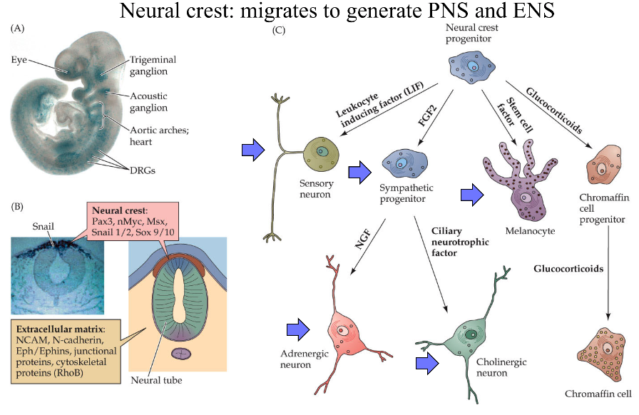
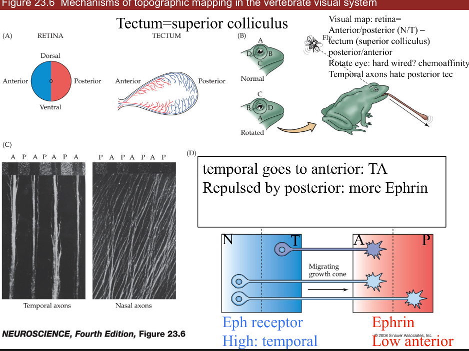
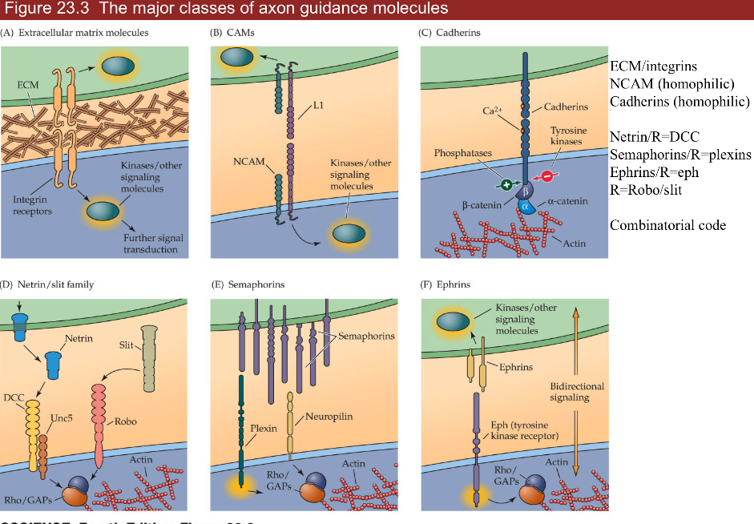
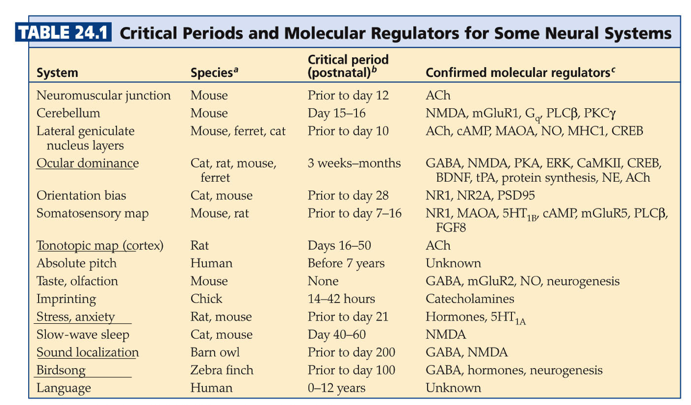

{:toc}

notes from Neuroscience, 5th edition + Intro to neurobiology course at UVA

# 22 early development

- ways to study
  1.  top-down: rosy retrospection
  2.  bottom-up: e.g. LTP/LTD
  3.  human disease: stroke-by-stroke
  4.  development=_ontogeny_
- timeframe
  - month 1 - gastrulation
    - most sensitive time for mom
  - month 2-5 - cells being born
  - up to year 2 - axon guidance / synapse formation

1. _gastrulation_ - process by which early embryo undergoes folds = shapes of NS
   - diseases
     - _spina bifida_ - neural tube fails to seal
       - vitamin B12 can fix this
     - _anencephaly_ - neural tube fails to close higher up
   - parts
     1. _roofplate_ at top (back)
     2. _floorplate_ on bottom (stomach)
     3. _neural crest_ - pinches off top of roofplate
2. _neuroblasts_ = classic stem cells
   - assymetric division - cells generate themselves and differentiated progeny
   - ultimate stem cell - fertilized eggs
3. _differentiation_
   - cells made by neuroblasts decide what they are going to become
   - _morphogens_
     - _BMP_ - roofplate
       - _cyclopia_ - fatal defect in BMP
     - _Hedge hogs_ - at floor plate
     - _Retinoids_ - axial, affect skin
       - affected by _thalidomide_ - helps morning sickness but causes missing limb segments
       - also affected by _accutane_
     - _FGFs_ - axial symmetry
     - _Wnts_ - skin, gut, hair
       - loss of wnts is loss of hair
   - floor plate loses function after embryogenesis except glioblastoma
   - measure BMP and HH gradient to figure out where you are
     - treat ALS by adding HH to make more alpha motor neurons
   1. dorsal direction
      - roofplate makes BMP
      - low HH - interneurons, sensory neurons (ex. nociceptors)
      - even BMP/HH - sympathetic
      - high HH - more motor neurons
      - _floorplate_ makes HH (hedge hog)
   2. axial specification (anterior/posterior)
      - tube swells into bulbs that become cerebellum, superior colliculus, cortex
   - _homeotic genes_ = _hox genes_ - set of genes (transcription factors) in order on chromosome
     - order corresponds to order of your body parts
     - _rhombomeres_ - segments in brainstem made by hox gene patterns
4. _lineages_
   - when neuroblast is born, starts producing progeny (family tree of neuron types)
   - very often, cells are produced in certain order
   - timing: cell-cell interations and tyrosine kinases determine order
   - first alpha neurons, then GABAergic to control those, last is glia
   - neural crest function
     - migratory - moves out and divides: 
     - _neuroblastoma_ - developed early - severe problem because missing parts of NS
     - makes DRG and associated glial cells (schwann cells)
     - makes sympathetic NS and target ganglia, enteric NS, parasympathetic NS targets
     - makes _melanocytes_ - know how to migrate and divide but can make _melanoma_ (cancer)
   - cortex is made inside out (6->1)
     - starts with stem cells called _radial glia_
     - _cortical dysplasia_ - missing a layer / duplicating a layer
       - small part with 2 layer 3s - severe epilepsy
5. _cell death_

   - 1/2 of cells die in development

6. _axon guidance_ (ch 23)
   - each cell born and axon grows and are guided to a target
   - dendrite basically follows same rules
7. _synapse formation_ (ch 23, 24)
   - pruning and plasticity
   - NMDA receptor type
   - form synapses and if they don’t look right - get rid of them
   - K1/K-1 synapses breaking and forming
   - after age 21, K-1 starts increasing and net loss of synapses

# 23 circuit formation

- _growth cone_ - motile tip of axon
  - _actin_ tip
    1. _lamellipodium_ - sheet (hand)
    2. _filopodium_ - huge curves (fingers)
       - chemo attraction (actin assembly) and chemo repulsion (actin disassembly)
  - microtubule shaft - _tubulin_ is much more cemented in
  - _mauthner cell_ of tadpole - first recorded growth cone
  - can't regrow (that's why we can't regrow spinal cord)
- signals in growing axons
  1.  _pioneer axons_ (Betz cells) are first - often die
  2.  _follower axons_ (other Betz cells) can jump onto these and connect before pioneer dies
  - _trophic support_ - neuron survives on contact
- frog _tectum_ (has superior colliculus) with map of retina: 
  - _ephrin_ (EPH) repulses axon
    - retinal NT -> tectum AP
    - axons have different amount of EPH receptors (in retina temporal has more than nasal)
    - gradient of EPH (in tectum anterior has less than posterior)
    - if we flip eye upside down (on nasal-temporal axis), image will be upside down
- 3 classes of axon guidance molecules: 
  1.  _ECM/integrins_
  2.  _NCAM_ (homophilic—binds to another neuron that is NCAM),
      - follower neurons bind to pioneer through NCAM-NCAM interactions
  3.  _Cadherin_ (homophilic)
      - involved in recognition of being some place
- 4 important ligands/receptors
  1.  _ephrins/eph_
      - gradient of eph receptor
  2.  _netrin/dcc_ = guidance moleculereceptor = DCC
      - attracts axons to floorplate (midline)
      - cells without DCC don't cross midline
  3.  _slit/robo_ - receptor is slit
      - chases axons off (away from midline)
      - axons not destined to cross midline are born expressing robo
      - axons destined to cross the midline only express robo after crossing
      - if DCC (-) and robo (-) will continue wandering around
      - _robo 4_ is associated with Tourette's
  4.  _semaphorins/plexins_
  - combinatorial code - use combinations of these to guide axons
  - these are the same genes that move cancer around
- synaptic formation
  - _neuroexins_ - further recognition
    - turn up in autism and schizophrenia
  - _DSCAM_
    - associated with Down's syndrome
    - doesn't use gradients
    - makes different kinds of proteins by differential slicing
- competition
  - _neurotrophins_ are secreted by muscle
    - in early development, a muscle fiber has many alpha motor neurons innervating it
    - all innervating neurons suck up neurotrophin and whichever sucks up most, kills all the others
    - eventually, each muscle fiber is innervated by one alpha motor neuron
    - only enough neurotrophin in target cells for a certain number of synapses
  - happens everywhere
    - ex. sympathetic ganglia
    - ex. sensory neurons in skin get axons to correct cell types based on neurotrophin
      - merkel - **BDNF**
      - proprioceptor - _NT3_
      - nociceptor - _NGF_
    - ex. muscles - produce NGF
      - treating ALS with NGF hyperactivates sensory neurons with trkA -> causes chicken pox
  - signals/receptors
    1. NGF - _trk a_ (_Trk receptor_ - survival signaling pathways)
    2. BDNF - _trk b_
    3. NT3 - trk b and _c_
    4. NT4/5 - trk b
    - all bind _p75_ (death receptor)
    - want to keep neurotrophins local, because there aren't that many of them

# 24 plasticity in systems

- experience-dependent plasticity - 
  - ex. ducks imprinting is non-reversable
  - learning is crystallized during _critical period_
    - _CREB_ and protein synthesis
    - _NMDA_ receptors
    - _epigenetics_ - histones control transcription and other things
  - follow _Hebb's postulate_ - fire together, wire together
    - different eyes firing together will sync up (NMDA receptors to strengthen synapses)
- systems
  1.  _ocular dominance_
      - left/right neurons terminate in adjacent zones
      - LGN in cortex uses efferents just like superior colliculus
      - label injected into retina can make it into cortex
      - cat experiments
        - some cells see only one eye, some see both
        - cats need to form visual map in short critical period (<6 days)
        - this is why you need cochlear implant early
        - both eyes open - equal OD columns
          - one eye closed - unequal OD columns
          - branches coming out of LGN neurons grow more branches based on relative light exposure (they compete for eye's real estate)
      - _strabismus_ = lazy eye - poor coordination with one of the muscles
        - one eye is not quite seeing
        - treat with patch on good eye -> allows bad eye to catch up since eyes compete for ocular dominance columns
        - more stimulus = more branches
      - dye from retina goes through thalamus into cortex
        - rabies virus does same thing: cell->ganglion->brain
  2.  _tonotopic map_
      - connection between MSO and inferior/superior colliculus
      - playing one tone increases representation
      - playing white noise disorganizes map
      - _birdsong_
        - hear song 10-20 times when young - crystallized
        - afterwards can't learn new skills
  3.  _stress_
      - early stress sets stress points later in life
      - uses serotonin
- shifts
  - _superior colliculus_ - integrate visual, auditory, motor to get X,Y coordinate
  - auditory map - plastic (but only when young)
  - visual map - not plastic
  - if you shift visual map (with a prism), auditory map can shift over to meet the visual
  - _optic neuritis_ - ms optic nerve disease that shifts map
  - only young animals can shift unless they were shifted before and are now unadapting

# 25 repair and regeneration

1. full repair - human _PNS_ - skin, muscles
   - 1-2 mm/day growth - speed of slow axonal transport
   - thinnest axons first (thermal receptors and nociceptors)
   - proprioceptors last
   - process
     - _perinerium_ / _schwann cells_ surrounds axons - helps regeneration
     - growth cones that are cut form stumps -> distal axons degenerate = _walerian degeneration_
     - macrophages come in and eat up the damaged stuff
     - neurotrophins are involved
   - miswiring is common - regrow and may not find right target
     - _bell's palsy_ - loss of facial nerve - recovers with miswiring (salivary / tear)
   - _neuromuscular junctions_ (NMJ)
     - damaged cells leave _synaptic ghost_ = glia and protein matrix for nerve to regrow into
     - repairs easily after heavy training
2. no repair / glial scar - human _CNS_
   - no ghost because so spread out
   - glia cover wound (scar) but can't develop further
   - has _astrocytes_ and _oligodendrocytes_ (types of glial cells)
     - don't support regrowth
     - involved in scarring
   - _microglia_ - from immune system
     - control inflammation
     - release cytokines
   - _nogo_ - protein that blocks regrowth (but there are other proteins as well)
   - we try repairing with _shunts_ - piece of sciatic nerve from other part of body with schwann cells from PNS to try to repair a connection in the CNS
3. stem cell regeneration - put new neurons being formed, 2 places in humans
   - non-human examples
     - floor plate of lizards can make new tail
     - fish retina always making new cells
     - canary brain part has stem cells that learn new song every year
   - small C14 incorporation after early development - suggests we don't regenerate neurons - C14 was from nuclear testing
   - human areas that do regenerate
     1. _hippocampus_
        - memories you store temporarily
     2. _subventricular zone_ makes _glomeruli_ in _olfactory bulb_ cells
        - turnover daily
        - sensory neurons and their targets constantly die and regenerate
     3. _niche_ - places where stem cells stay alive
        - ex. places in CNS with WINT molecular signals

- damage control - remove these signals for _apoptosis_ = cell death
  - _glutamate increase_ - excitotoxicity
    - can stop with _NMDA blockers_
    - induce a coma by cooling them down or _GABA drugs_
  - _cytokines increase_ - immune system (like neurotrophins), inflammation
  - _hypoxia/stress_
  - _neurotrophin withdrawal_
    - in stress times neurotrophin goes down
