{:toc}

notes from Neuroscience, 5th edition + Intro to neurobiology course at UVA

# 16 lower

- sensory in dorsal spinal cord, motor in ventral
  - farther out neurons control farther out body parts (medial=trunk, lateral=arms,legs)
- one motor neuron (MN) innervates multiple fibers
  - the more fibers/neuron, the less precise
  - _MN pool_ - group of MNs=motor units
- muscle tone = all your muscles are a little on, kind of like turning on the car engine and when you want to, you can move forward
  - more firing = more contraction
- MN types
  1. fast fatiguable - white muscle
  2. fast fatigue-resistant
  3. slow - red muscles, make atp
  - muscles are innervated by a proportion of these MNs
- reflex
  - whenever you get positive signal on one side, also get negative on other
  - _flexor_ - curl in (bicep)
  - _extensor_ - extend (tricep)

1. proprioceptors (+) - measure length - more you stretch, more firing of alpha MN to contract

- _intrafusal muscle=spindle_ - stretches the proprioceptor so that it can measure even when muscle is already stretched
  - $\gamma$ motor neuron - adjusts intrafusal muscles until they are just right
    - keeps muscles tight so you know how much muscle is streteched
    - if alpha fires a lot, gamma will increase as well
      - high gamma allows for fast responsiveness - brainstem modulators (serotonin) also do this
  - opposes muscle stretch to keep it fixed
  - spindle -> activates muscles -> contracts -> turns off
  - sensory neurons / gamma MNs innervate muscle spindle
- homonymous MNs go into same muscle, antagonistic muscle pushes other way

2. _golgi tendon_ (-) measures pressure not stretch

- safety switch
- inhibits homonymous neuron so you don't rip muscle off
- _ALS_ = Lou Gehrig's disease
  - MNs are degenerating - reflexes don't work
  - progressive loss of $\alpha$ MNs
  - last neuron to go is superior rectus muscle -> people use eyes to talk with tracker
- _CPG_ = central pattern generator
  - ex. step on pin, lift up leg
  - walking works even if you cut cat's spinal cord
  - collection of interneurons

# 17 upper

- 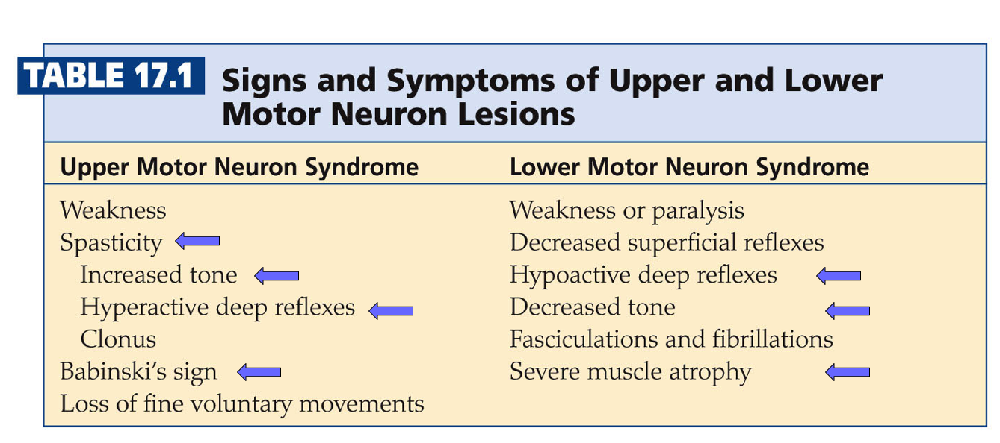
- 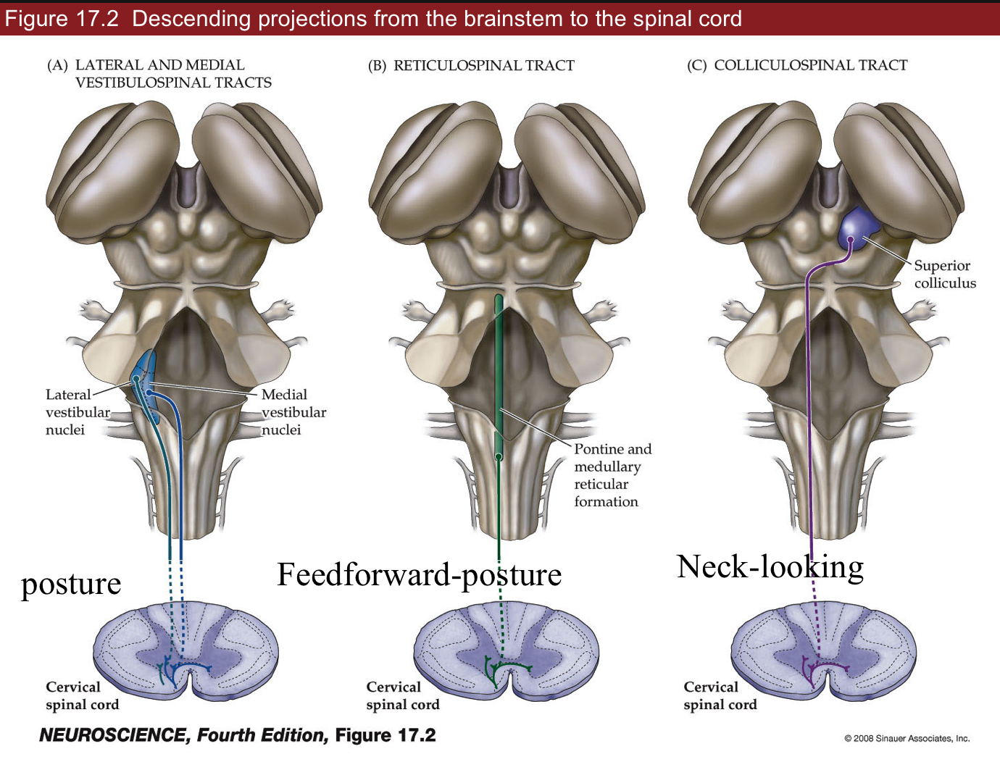
- 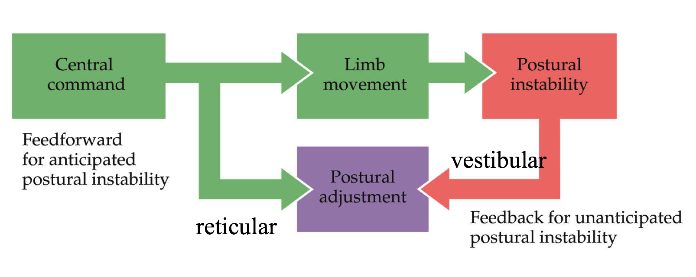
- 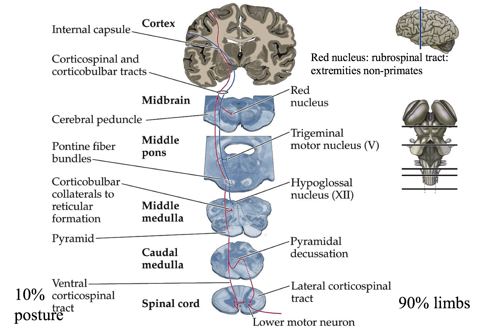
- cAMP is used by GPCR
- lift and hold circuit
  1. ctx->_lateral white matter_->lateral ventral horn->limb muscles
  - lateral white matter - most sensitive to injury
  2. brainstem->_medial white matter_->medial horn->trunk
  - medial white matter -> goes into trunk
- _bulbarspinal tracts_
  1. lateral and medial _vestibulospinal_ tracts - feedback
  - automated system - not much thinking
  - posture - reflex
  - too slow for learning surfing
  2. _reticular_ - feedforward = anticipate things before they happen
  - command / control system for trunk muscles (posture)
  - feedforward - not a reflex, lean back before opening drawer
  - _caudal pontine_ - feeds into spinal cord
  3. _colliculospinal_ tract
  - has _superior colliculus_ - eye muscles, neck-looking
  - see ch. 20 - reflex
- _corticular bulbar tract_ (premotor->primary motor->brainstem)
  - motor cortexes - this info is _descending_
  - can override reticular reflexes in reticular formation
  - premotor cortex (P2) - contains all actions you can do
    - has _mirror neurons_ that fire ahead of primary neurons
      - fire if you think about it or if you do it
  - primary motor cortex (P1)
    - layer 1 ascending
    - layer 4 input
    - layer 5 - _Betz cells_ - behave like 6 (output)
    - layer 6 - descending output
    - has map like S1 does
      - _Jacksonian march_ get seizure that goes from feet to face (usually one side)
        - epileptic seizure - neurons fire too much and fire neurons near them
          - _insular_ - flashes of moods
          - _pyriform_ - flashes of smells
  - _Betz cells_ - if they fire, you will do something
    - dictate a goal, not single neuron to fire
    - axons to _ventral horn_ of spinal cord
- lesions
  1. upper
  - _spasticity_ - unorganized leg motions
  - increased tone - tight muscles
  - hyperactive deep reflexes
    - ex. _babinski's sign_
    - curl foot down a lot because you don't know how much to curl
    - curling foot down = _normal plantar_
    - more serotonin can cause this
  2. lower
  - hypoactive deep reflexes
  - decreased tone
  - severe muscle atrophy
- pathways
  - Betz cell
    - 90% cross midline in brainstem - control limbs
    - 10% don't cross - trunk muscles

# 18 basal ganglia (choose what you want to do)

- 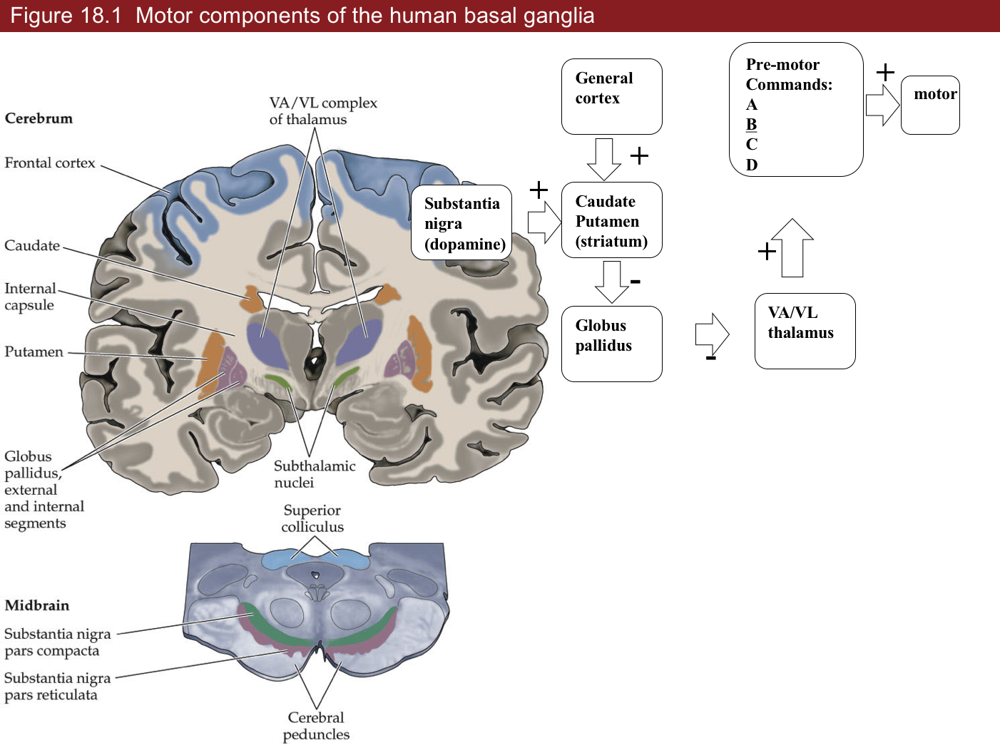
- 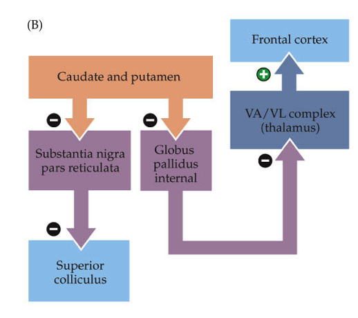
- 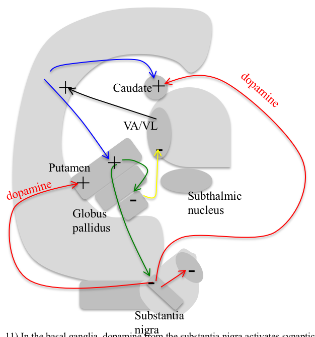
- "who you are"
- outputs
  1. brainstem
  2. motor cortex
- 4 loops (last 2 aren't really covered)
  - motor loops
    1. _body movement loop_
    - _SnC -> S (CP) -> (-) Gp -> (-) VA/VL -> motor cortex_
    2. _oculomotor loop_
    - _cortex -> caudate -> substantia nigra pars reticulata -> superior colliculus_
  - non-motor loops 3. _prefrontal loop_ - daydreaming (higher-order function)
    - spiny neurons corresponding to a silly idea (alien coming after you) filtered out because not fired enough
    - schizophrenia - can't filter that out
    4. _limbic loop_ - mood
    - has _nucleus accumbens_
    - can make mood better with dopamine
- _substantia nigra_
  1. _pars compacta_ - dopaminergic neurons (input to striatum)
  - more dopamine = more strength between cortical pyramidal neurons and spiny neurons (turns up the gain)
  - dopamine helps activate a spiny neuron
  - may be the ones that learn (positive outcome is saved, will result in more dopamine later)
  - _Parkinson's_ - specific loss of dopaminergic neurons
    - dopaminergic neurons form _melanin_ = dark color
    - when you get down to 20% what you were born with
    - know what they need to do - don't have enough dopamine to act
    - treat with L Dopa -> something like dopamine -> take out globus pallidus
  - cocaine, amphetamine - too much dopamine
  - _Huntington's_ - death of specific class of spiny neurons
    - have uncontrolled actions
  - _Tourette's_ - too much dopamine
    - also alcohol
  - MPPP (synthetic heroin)
    - MPTP looks like dopamine but turns into MPP and kills dopaminergic neurons
    - treated with L Dopa to reactivate spiny neurons
  2. _pars reticulata_
  - doesn't have dopamine (output from striatum)

1. _striatum_ contains spiny neurons
1. _caudate_ (for vision) - output to globus pallidus and substantia nigra (pars reticulata)
1. _putamen_ - output only to globus pallidus

- each spiny neuron gets input from ~1000 cortical pyramidal cells

2. _globus pallidus_

- each spiny neuron connects to one globus pallidus neuron
- deja vu - spiny neuron you haven't fired in a while

3. _VA/VL_ (thalamus)

- all motor actions must go through here before cortex
- has series of commands of all actions you can do
- has parallel set of betz cells that will illicit those actions
- VA/VL is always firing, globus pallidus inhibits it (tonic connection)

# 19 cerebellum (fine tuning all your motion)

- 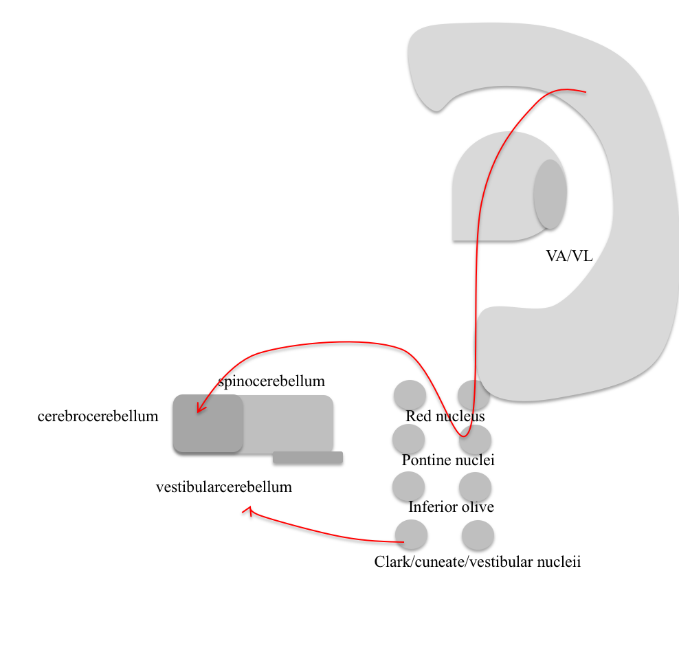
- 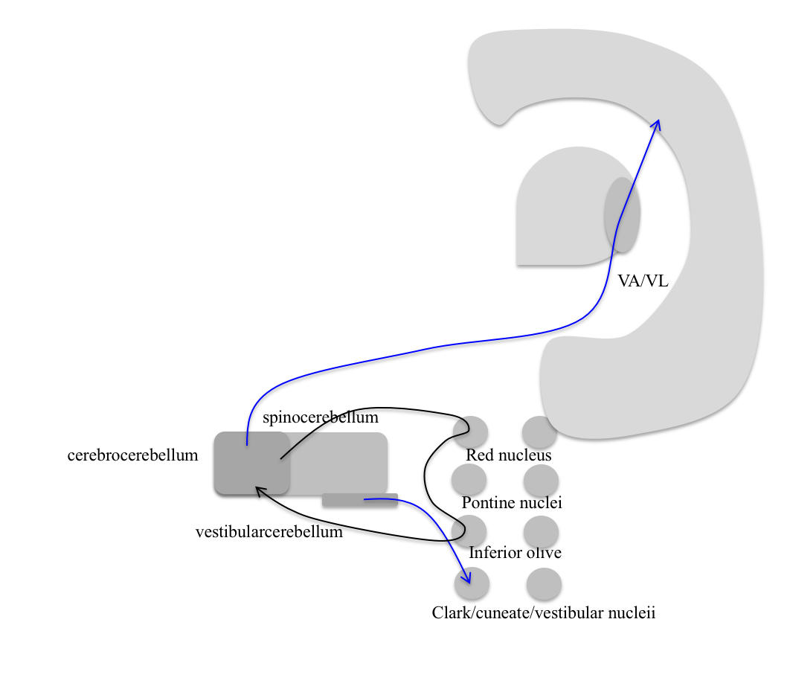
- 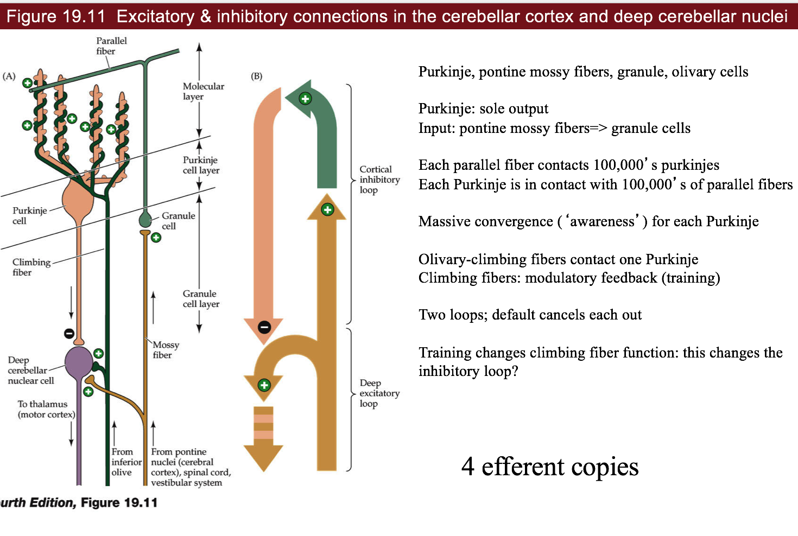
- 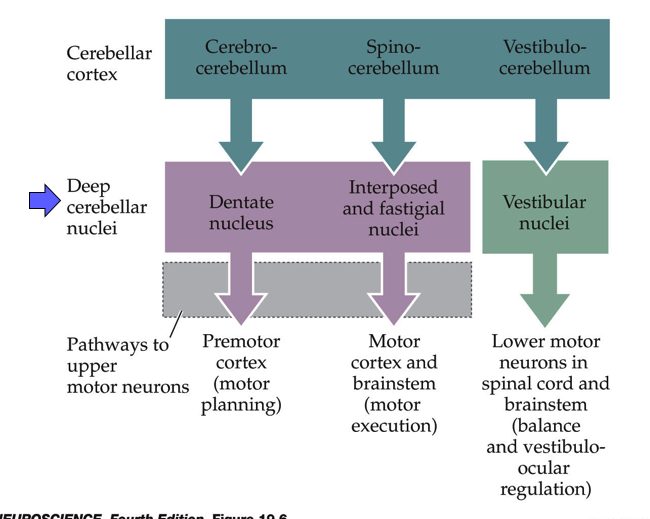
- 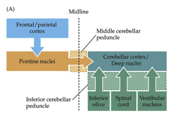
- 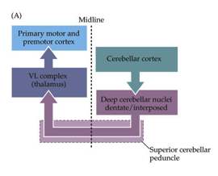
- 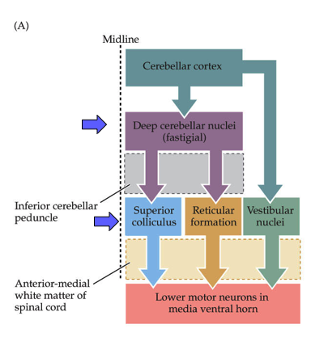
- redundant system - cortex could do all of this, but would be slow
- repeated circuit - interesting for neuroscientists
- all info comes in, gets processed and goes back out
  - cerebellum gets motor _efferant copy_
  - all structures on your brain that do processing send out efferent
  - cerebellum sends efferant copy back to itself with time delay (through inferior olive)

1. _cerebrocerebellum_
   - deals with premotor cortex (mostly motor cortex)
2. _spinocerebellum_ = _clarke’s nucleus_, knows stretch of every muscle, many proprioceptors go straight into here

- motor cortex
- has a map of muscles

3. _vestibular cerebellum_ - vestibular->cerebellum->vestibular

- vestibular system leans you back but if wind blows, have to adjust to that
- input
  - _pontine_ nuclei (from cortex)
  - _vestibular_ nuclei (balance)
  - _cuneate_ nucleus (somatosensory from spinal upper body)
  - _clarke_ (proprio from spinal lower body)
- processing
  - cerebellar deep nuclei
- output
  - deep cerebellar nuclei
    - go to superior colliculus, reticular formation
  - VA/VL (thalamus) - back to cortex
  - red nucleus
- circuit 1 - fine-tuning
- circuit 2 - detects differences, adjusts
  - cerebellum -> _red nucleus_ (is an efferant copy) -> _inferior olive_ -> cerebellum
  - compare new copy to old copy
- cells
  - _purkinje cells_ - huge number of dendrite branches - dead planar allows good imaging
    - GABAergic
  - (input) mossy fibers -(+)> granule cells (send parallel fibers) -(+)> purkinje cell -(-)> deep cerebellar nuclei (output)
    1. _mossy->granule->parallel fibers_ connect to ~100,000 parallel fibers
    2. _climbing fiber_ - comes from inferior olive and goes back to purkinje cell (this is the efferent copy) = training signal
  - loops
    - deep excitatory loop (climbing/mossy) -(+)-> deep cerebellar nuclei
    - cortical inhibitory loop (climbing/granule) -(+)-> purkinje
      - the negative is from purkinje to deep cerebellar nuclei
- alcohol
  - can create gaps = _folia_
  - long-term use causes degeneration = _ataxia_ (lack of coordination)

# 20 eye movements/integration

- 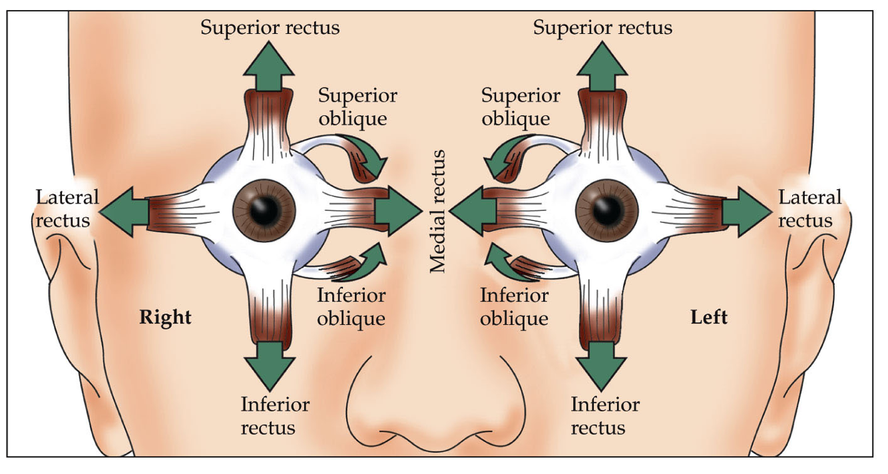
- 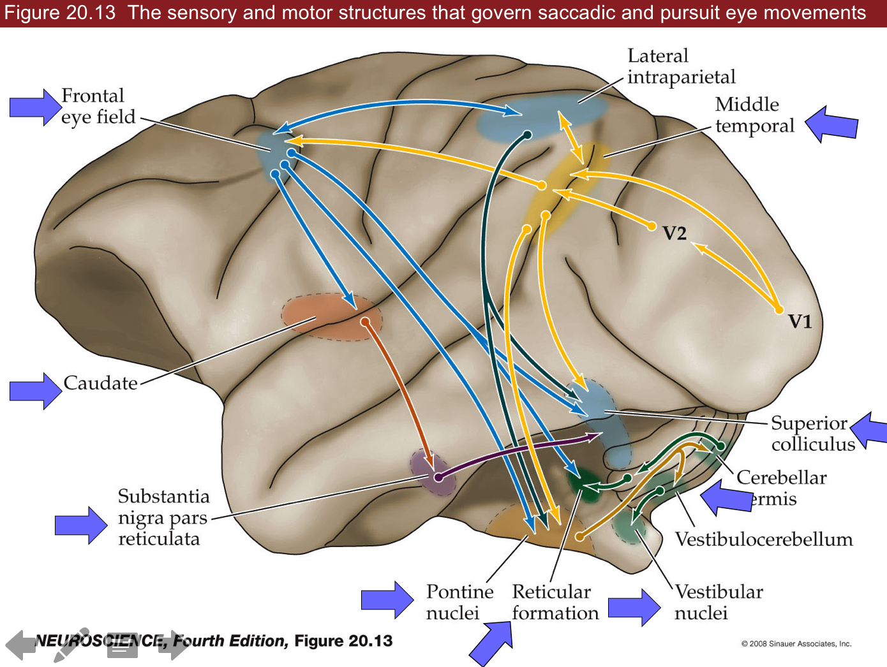
- Broca's view - look at people with problems
- Ramon y Cajal - look at circuits
- 5 kinds of eye movements
  1. _saccades_
  - use cortex, superior colliculus (visual info -> LGN -> cortex, 10% goes to brainstem)
  - constantly moving eyes around (fovea)
  - ~scan at 30 Hz
  - 5 Hz=200 ms for cortex to process so pause eyes (get 5-6 images)
    - there is a little bit of drift
  - can't control this
  - humans are better than other animals at seeing things that aren't moving
  2. _VOR_ - vestibular ocular reflex - keeps eyes still
  - use vestibular system, occurs in comatose
  - fast
  - works better if you move your head fast
  3. _optokinetic system_ - tracks with eyes
  - ex. stick head out window of car and track objects as they go by
  - slower than VOR (takes 200 ms)
  - works better if slower
  - reflex
  - in cortex (textbooks) but probs brainstem (new)
  4. _smooth pursuit_ - can track things moving very fast
  - suppress saccades and track smoothly
  - only in higher apes
  - _area MT_ is highest area of motion coding and goes up and comes down multiple ways
  - high speed processing isn't understood
    - could be retina processing
  5. _vergence_ - crossing your eyes
  - suppresses conjugate eye movements
  - we can control this
  - only humans - bring objects up very close
  - reading uses this
- eye muscles
  - rectus
    - vertical
      - superior
      - inferior
      - use complicated _vertical gaze center_
        - last to degenerate in ALS
        - _locked-in syndrome_ - can only move eyes vertically
        - controls oculomotor nucleus
    - lateral
      - medial
      - lateral (controlled by _abducens_)
      - use _horizontal gaze center=PPRF_ which talk to abducens -_MLF_ connects abducents to opposite medial lateral rectus muscle
    - oblique - more circular motions
      - superior (controlled by _trochlear nucleus_)
      - inferior
  - everything else controlled by _oculomotor nucleus_
- _superior colliculus_ has visual map
  - controls saccades, connects to gaze centers
  - takes input from basal ganglia (oculomotor loop)
  - also gets audio input from inferior colliculus (hear someone behind you and turn)
  - gets strokes
  - redundant with _frontal eye field_ in secondary motor cortex
    - connects to superior colliculus, gaze center, and comes back
    - if you lose one of these, the other will replace it
    - if you lose both, can't saccade to that side

# 21 visceral (how you control organs, stress levels, etc.)

- 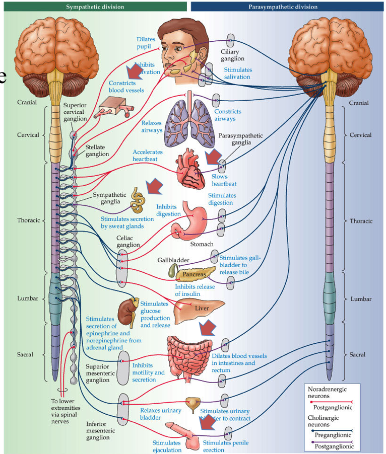
- 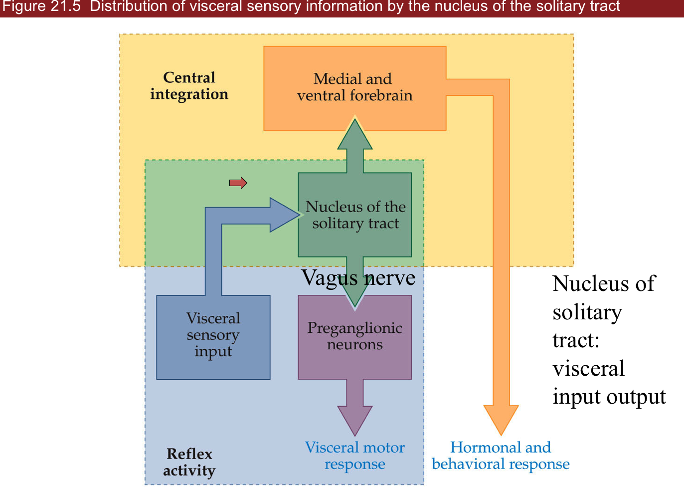
- 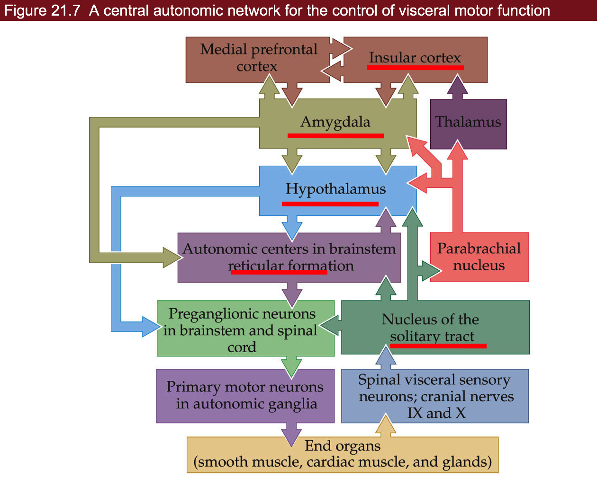
- 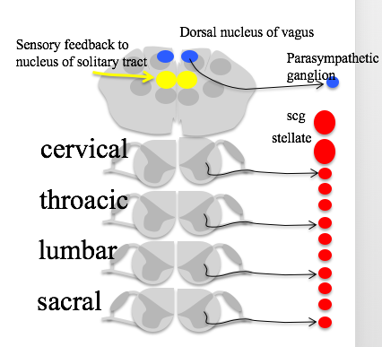
- parasympathetic works against sympathetic
- divisions
  1. _sympathetic_ - fight-or-flight (_adrenaline_)
  - functions
    - neurons to smooth muscle
    - pupils dilate
    - increases heart rate
    - turn off digestive system
    - 2 things with no parasympathetic counterpart
      - increase BP
      - sweat glands
  - location
    - neurons in spinal cord lateral horn
      - send out neurons to sympathetic trunk (along the spinal cord)
      - all outgoing connections are adrenergic
  - beta-adrenergic drugs block adrenaline
    - beta agonist - activates adrenaline receptors (do this before EKG)
  2. _parasympathetic_ - relaxing (_ACh_)
  - location
    1. brainstem
    1. _edinger westphal nucleus_ - pupil-constriction
    1. _salivatory nucleus_
    1. _vagus nucleus_ - digestive system, sexual function
    1. _nucleus ambiguous_ - heart
    1. **nucleus of the solitary tract**

        - all input/output goes through this
        1. *rostral* part (front) - taste neurons
        2. *caudal* part (back) contains all sensory information of viscera (ex. BP, heart rate, sexual
    2. _sacral_ spinal cord (bottom) - gut/bladder/genitals
    - not parallel to sympathetic – poor design - may cause stress-associated diseases
  - hard to make drugs with ACh
  3. _enteric_ nervous system - in your gut
  - takes input through _vagus nerve_ from vagus nucleus
  - also has sensory neurons and sends afferents back to brainstem
- pathway
  - _insular cortex_ - what you care about
  - _amygdala_ - contains emotional memories
  - _hypothalamus_ - controls a lot
    - mostly peptinergin neurons
    - aging, digestion, mood, straight to bloodstream & CNS
    - releases hormones
    - ex. _leptin_ - stops you eating when you eat calories
  - _reticular formation_ - feedforward, prepares digestion before we eat
- three examples
  1. heart rate
  - starts at nucleus ambiguous
  - also takes input from chemoreceptors (ex. pH)
  - _SA node_ at heart generates heartbeat - balances Ach and adrenaline
    - sympathetic sends info from thoracic spinal cord
  - heart sends back _baroreceptor afferents_
  2. bladder function
  1. parasympathetic in sacral lateral horn make you pee (contracts bladder)
  1. turn off sympathetic NS
  1. open sphincter muscle (voluntary)
  - can also control this via skeletal nervous system
  - circuit
    - _amygdala_ (can't pee when nervous)
    - _pontine micturation center_ -> _parasympathetic preganglionic neurons_ -> _parasympathetic ganglionic neurons_
    - _inhibitory local_ circuit neurons -> _somatic MNs_
  3. sexual function
  - _Viagra_ turns on parasympathetic NS
    - also gives temporal color blindness
  - sympathetic involved in ejaculation
    - temporal correlation ("Point and Shoot")
