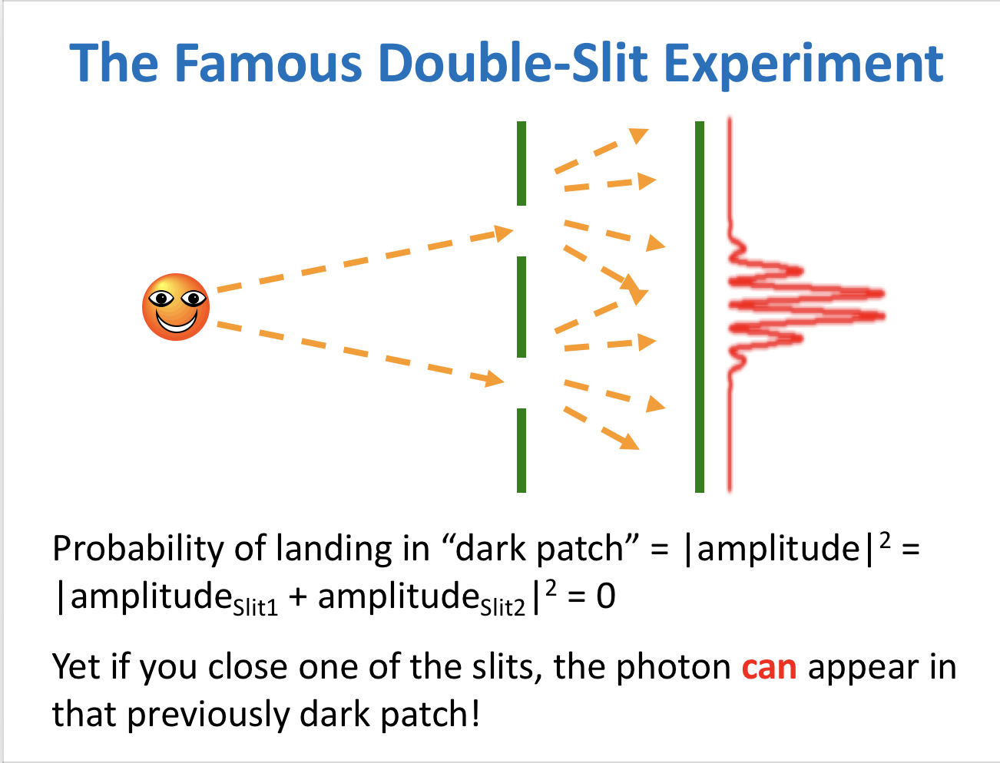

{:toc}

Some *very limited* notes on quantum computing

- what does physics tell us about the limits of computers?
- NP - can check soln in polynomial time
- NP-hard - if solved, solves every NP
- NP-complete - NP hard and in NP
- *church-turing thesis* $\implies$ turing machine polynomial time should be best possible in the universe
  - physics could allow us to do better than a turing machine
- examples
  - glass plates with soapy water - forms minimum steiner tree
  - can get stuck in local optimum
  - ex. protein folding
  - ex. relativity computer
    - leave computer on earth, travel at speed of light for a while, come back and should be done
    - if you want exponential speedup, need to get exponentially close to speed of light (requires exponential energy)
  - ex. zeno's computer - run clock faster (exponentially more cooling = energy)

# basics
- An n-bit computer has 2^n states and is in one of them with probability 1.  You can think of it as having 2^n coefficients, one of which is 0 and the rest of which are 1.  Operations on it are multiplying these coefficients by stochastic matrices.  Only produces n bits of info.
- an n-qubit quantum computer is described by 2^n complex coefficients.  The sum of their squares sums to 1.  It’s 2^n complex coefficients must be multiplied by unitary matrices (they preserve that the sum of the squares add up to 1.)
- Problem: **Decoherence** – results from interaction with the outside world
- Properties: 	
	- Superposition – an object is in more than one state at once
		- Has a percentage of being in both states
	- Entanglement – 2 particles behave exactly the opposite – instantly

# storing qubits
- Fullerenes – naturally found in Precambrian rock, reasonable for storing qubits – can store 
	- not developed, but some experiments have shown ability to store qubits for milliseconds

# intro

- probability with minus signs
- *amplitudes* - used to calculate probabilites, but can be negative / complex

- applications
  - quantum simulation
  - also could factor integers in polynomial time (shor 1994)
  - scaling up is hard because of *decoherence*= interaction between cubits and outside world
  - error-correcting codes can make it so we can still work with some decoherence
- algorithms
  - paths that lead to wrong answer - quantum amplitudes cancel each other out
  - for right answer, quantum amplitudes in phase (all positive or all negative)
  - prime factorization is NP but not NP complete
  - unclear that quantum can solve all NP problems
  - *Grover's algorithm* - with quantum computers, something like you can only use sqrt of number of steps
  - *adiabatic optimization* - like quantum simulated annealing, maybe can solve NP-complete problems
- dwave - company made ~2000 cubit machine
  - don't maintain coherence well
  - algorithms for NP-complete problems may not work
  - hope: *quantum tunneling* can get past local maximum in polynomial time maybe
    - empircally unclear if this is true
- quantum supremacy - getting quantum speedup for something, maybe not something useful

# maxwell's demon

- second law of thermodynamics: entropy is always increasing
- hot things transfer heat to cold things
  - temperature is avg kinetic energy - particles follow a diistribution of temperature
- separate 2 samples (one hot, one cold) with insulator
  - **idea**: demon makes all fast particles go to hot side, all slow particles go to slow side - **this is against entropy**
  - demon controls door between the samples
  - 
    - demon opens door whenever high temperature particle comes from cold sample, then closes
    - demon opens door for slow particles from hot sample, then closes
- problem: demon has to track all the particles (which would generate a lot of heat)

# quantum probability

- based on this [blog post](https://www.math3ma.com/blog/a-first-look-at-quantum-probability-part-1)

  - marginal prob. loses information but we don't need to
- 
  
  