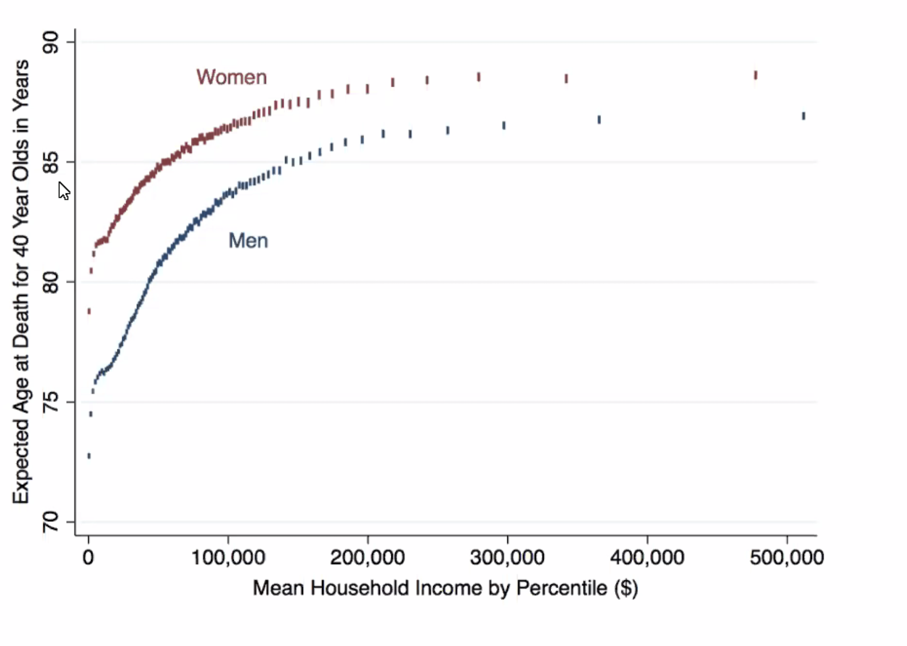

{:toc}

Some interesting papers in science and statistics.

- [Moravec's paradox](https://en.wikipedia.org/wiki/Moravec%27s_paradox)
- [Held & Hein 1963](https://marom.net.technion.ac.il/files/2016/07/Held-1963.pdf) - moving kittens
- [Human attention vqa dataset (VQA HAT) ~ 60k images](https://computing.ece.vt.edu/~abhshkdz/vqa-hat/)
- [Understanding deep learning requires rethinking generalization](https://arxiv.org/abs/1611.03530)
- [Mike the headless chicken](https://en.wikipedia.org/wiki/Mike_the_Headless_Chicken)
- [thompson 96 evolved circuit](https://link.springer.com/chapter/10.1007/3-540-63173-9_61)
- [The Code for Facial Identity in the Primate Brain](https://www.sciencedirect.com/science/article/pii/S009286741730538X) - can decode 50 face components from 206 neurons
- [Stimulating memory](https://www.wired.com/story/ml-brain-boost/)
- [herculano-houzel talk](http://www.suzanaherculanohouzel.com/lab) 
- TMS - changing people’s minds
- [Different languages, similar encoding efficiency: Comparable information rates across the human communicative niche](https://advances.sciencemag.org/content/5/9/eaaw2594)
  - [“Languages vary a lot in terms of the information that they pack into a syllable and also in the rate that they are spoken at. But the interesting thing is that the two kind of balance each other, so that more information dense languages are spoken slower, and those that are less informationally heavy are spoken faster. This means that there is a steady information rate that is very similar among languages](https://www.technologynetworks.com/neuroscience/news/different-tongue-same-information-17-language-study-reveals-how-we-all-communicate-at-a-similar-323584?fbclid=IwAR2pZfXqaaQbSkOpiXt6x8Uqj_fX2iwxsPp-f7CJaYSZ0Nrm_slez58_Epc)
- [BOIDS](https://en.wikipedia.org/wiki/Boids): cool simple algorithm for emergent behavior
- [Image Synthesis with a Single (Robust) Classifier](https://papers.nips.cc/paper/8409-image-synthesis-with-a-single-robust-classifier.pdf)
- [Shrew skulls shrink for winter survival](https://www.nature.com/news/shrew-skulls-shrink-for-winter-survival-1.22874)
- [Performance-optimized hierarchical models predict neural responses in higher visual cortex](https://www.pnas.org/content/111/23/8619) (yamins et al. 2014)
- [Natural speech reveals the semantic maps that tile human cerebral cortex](https://www.nature.com/articles/nature17637) (huth et al. 2016)
- [A Mathematical Theory of Communication](https://onlinelibrary.wiley.com/doi/10.1002/j.1538-7305.1948.tb01338.x) (shannon 1948)
- [hopfield networks](https://en.wikipedia.org/wiki/Hopfield_network)
- benjamini-hoffberg - controlling decision rate
- infogan chen et. al 16
- visual deep reps ganguli 19
- rulefit friedman & popescu 19
- [Approximating CNNs with Bag-of-local-Features models works surprisingly well on ImageNet](https://arxiv.org/abs/1904.00760) (brendel & bethge 2019)
- [statistical learning by 8-month-old infants 1996](http://science.sciencemag.org/content/274/5294/1926)
- [Unpaired Image-To-Image Translation Using Cycle-Consistent Adversarial Networks](http://openaccess.thecvf.com/content_iccv_2017/html/Zhu_Unpaired_Image-To-Image_Translation_ICCV_2017_paper.html) (zhu et al. 2017)
- [cyclegan 17](http://openaccess.thecvf.com/content_iccv_2017/html/Zhu_Unpaired_Image-To-Image_Translation_ICCV_2017_paper.html)
- [oregan 01 vision philosophy](https://www.cambridge.org/core/journals/behavioral-and-brain-sciences/article/sensorimotor-account-of-vision-and-visual-consciousness/BA1638CB7389102A12B336CE687EC270)
- [The Association Between Income and Life Expectancy in the United States, 2001-2014](https://jamanetwork.com/journals/jama/article-abstract/2513561)
  - 
- [aztecs, mayans predicted eclipses with data](https://www.statesman.com/story/news/2017/08/19/aztecs-mayans-marveled-at-eclipses-and-predicted-them-with-precision/10122181007/)