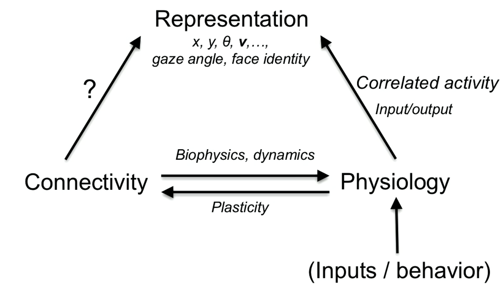

# physiology, connectivity, represention, and manifolds

- clay reid, ABA, at Simons Institute
- 
- how can we learn from only connectivity?
  - correlated connectivity instead of correlated activity
- calcium-imaging of lots of neurons at same time at color by orientation
  - lots of like-to-like connectivity (red to red, green to green)
- very slow: similar experiments with $~10^6$ neurons
- apical dendrites go in bundles
- relationships: 
- from connecitons try to learn lgn, simple cells, complex cells...
- **start with wiring diagram + assume like-to-like connectivity**
  - simple model
  - distance between LGN RF centers can be founds using Djikstra on correlation-based pseudodistance of cells
  - can try to get RFs from weights
- knowing connectivity simple->complex, get manifolds
  - can get retinotopy
- applying to alexnet
  - dimensionality reduction on weights from layer 1 -> layer 2 (e.g. mdp/isomap/t-sne)
  - dimensionality reduction on activations (~physiology)
    - sloppier version of sorting the filters
- questions
  - when do representations live on a manifold
  - when do individual neurons encode functions on that manifold?
  - how often is that representation derived from the connectome
  - when is physiology best? anatomy best? both?
- faults
  - population, recurrence
  - dynamics
  - individual diffs (this is fine - regularities between people)
  - metric for fitting this to real data
  - cortex might have simple repeated circuit of transforming manifold